# Research "Notebook" to track changes made in certain scripts and codes

## Early summer 2024

I got sick... But I read some papers and wrote the magpinchsimple problem generator:

```c++
  for (int k=ks; k<=ke; k++) {
    for (int j=js; j<=je; j++) {
      for (int i=is; i<=ie; i++) {
        // Volume centered coordinates and quantities
        Real x1,x2,dx;
      
        x1 = pcoord->x1v(i);
        dx = pcoord->x1v(i+1) - x1;
        x2 = pcoord->x2v(j);

        Real rho = rho0*std::pow(std::abs(x1), alpha/4);
        Real P   = P0  *std::pow(std::abs(x1), 2*beta);

        phydro->u(IDN,k,j,i) = rho;         // Density

        // x momentum
        phydro->u(IM1,k,j,i) = -rho*vin*std::tanh(x1/(2*dx))*(1+0.01*std::cos(x2/2));

        phydro->u(IM2,k,j,i) = 0.0;         // Momentum in x2
        phydro->u(IM3,k,j,i) = 0.0;         // Momentum in x3
        phydro->u(IEN,k,j,i) = P/gm1 + 0.5*rho*SQR(vin); // Total energy
        debug_tester = P/gm1 + 0.5*rho*SQR(vin); // TODO REMOVE
      }
    }
  }

    Real x1, dx;
    for (int k=ks; k<=ke; k++) {
      for (int j=js; j<=je+1; j++) {
        for (int i=is; i<=ie; i++) {    // j loop for(int j=0; j<=je+js; i++)
          x1 = pcoord->x1v(i);
          dx = pcoord->x1v(i+1) - x1;
          pfield->b.x2f(k,j,i) = b*std::tanh(x1/(2*dx));
        }
      }
    }
```

Unfortunately, I'm getting weird zeros (?) all over the place in a region close to the origin. Here is the initial conditions at t=0 (when using std::cos() on left and std::sin() on right):

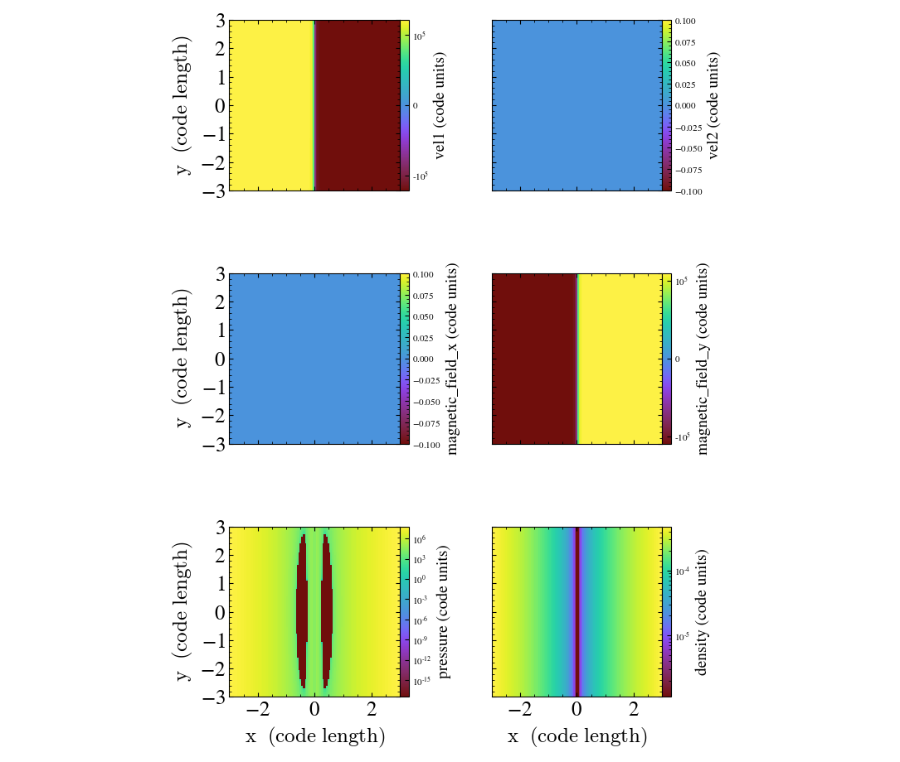
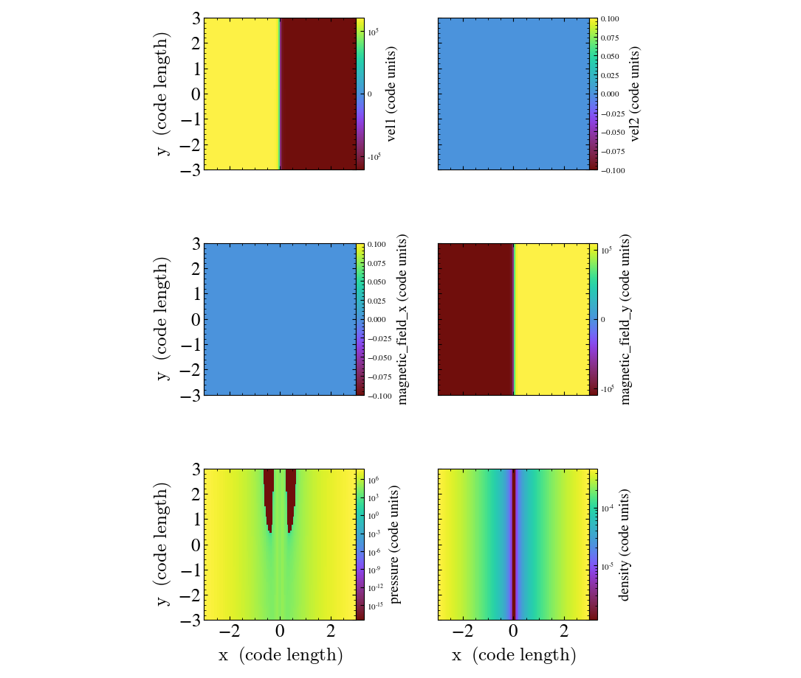

## Meeting with Brian May 2 2024

We are pushing the simulations very hard...

Consider trying the magnetic field to be on order $tanh(x/2\Delta x)$, and the velocity to be on order $tanh(x/\Delta x)$

To be more precise:

$$v_x=-v0 tanh(x/2\Delta x)$$

$$B_y=btanh(x/ 2\Delta x)$$

Then make velocity to be on order equivalent to Magnetic Field, and thermal pressure ($v^2~B^2~P_th$), and set density and thermal pressure to be constant.

## Comprehensive list of everything attempted as of May 1 2024
The original goal was to simulate the z-pinch to give me a grasp of how Athena++ works. This, initially, was successful, and can be seen at athena_files/zpinch5_density_Bfield.mp4. To get closer to the MARZ experiment, we added a slight perturbation in the radial direction, and set the resistivity (eta_ohm) in the athinput file to be nonzero to trigger magnetic reconnection. In the complicated simulation, we got this to work, and can be seen in athena_files/zpinchCP3_density_velocity.mp4.

We then wanted to isolate the magnetic reconnection bit, so we decided to 'flatten out' the radial component, and make an inflow along the x-direction, strongest at $y=0$, and put opposing B-fields in the $x>0$ and $x\leq0$ regions. The full initial conditions set up is as follows:

$$\textbf{u}=(-sgn(x)\frac{\rho v_{in}}{y+1/3},0,0)$$

$$\textbf{B}=(0,sgn(x) \frac{b}{\beta+1} (x)^{\beta+1},0)$$ 

By default, $\beta=2.5$, $v_in=2e7$ (usually), and $b=5e5$ (usually, more on that later). This configuration should yield the y and z velocities to be 0 everywhere, and the x and z magnetic fields to be 0. Originally, I borrowed the problem generator from the magnoh problem, and removed the radial component. I didn't realize the magnetic field needed to be face-centered, so I unintentionally deleted one of the for loops that handled this case, and it entirely broke. For a few weeks we dealt with that error. Originally, the magnoh problem set the b-field with the following loops (I include pressure here as well):

```c++
  if (MAGNETIC_FIELDS_ENABLED) {
    for (int k=ks; k<=ke; k++) {
      for (int j=js; j<=je; j++) {
        for (int i=is; i<=ie+1; i++) {
          Real geom_coeff = 1.0;
          if (std::strcmp(COORDINATE_SYSTEM, "cylindrical") == 0) {
            geom_coeff = 1.0/pcoord->x1f(i);
          }
          pfield->b.x1f(k,j,i) = geom_coeff*(az(j+1,i) - az(j,i))/pcoord->dx2f(j);
        }
      }
    }
    for (int k=ks; k<=ke; k++) {
      for (int j=js; j<=je+1; j++) {
        for (int i=is; i<=ie; i++) {
          Real geom_coeff = 1.0;
          if (std::strcmp(COORDINATE_SYSTEM, "cylindrical") == 0) {
            geom_coeff = -1.0; // Left hand system?
          }
          pfield->b.x2f(k,j,i) = geom_coeff*(az(j,i) - az(j,i+1))/pcoord->dx1f(i);
        }
      }
    }
    for (int k=ks; k<=ke+1; k++) {
      for (int j=js; j<=je; j++) {
        for (int i=is; i<=ie; i++) {
          Real rad;
          if (std::strcmp(COORDINATE_SYSTEM, "cylindrical") == 0) {
            rad = pcoord->x1v(i);
          } else {
            rad = std::sqrt(SQR(pcoord->x1v(i)) + SQR(pcoord->x2v(j)));
          }
          pfield->b.x3f(k,j,i) = bz*std::pow(rad,beta);
        }
      }
    }
    if (NON_BAROTROPIC_EOS) {
      for (int k=ks; k<=ke; k++) {
        for (int j=js; j<=je; j++) {
          for (int i=is; i<=ie; i++) {
            phydro->u(IEN,k,j,i) +=
                // second-order accurate assumption about volume-averaged field
                0.5*0.25*(SQR(pfield->b.x1f(k,j,i) + pfield->b.x1f(k,j,i+1))
                          + SQR(pfield->b.x2f(k,j,i)  + pfield->b.x2f(k,j+1,i))
                          + SQR(pfield->b.x3f(k,j,i) + pfield->b.x3f(k+1,j,i)));
          }
        }
      }
    }
```

When I tried to implement the field configuration we wanted originally, this is what I came up with:

```c++
    for (int k=ks; k<=ke; k++) {
      for (int j=js; j<=je+1; j++) {
        for (int i=is; i<=ie; i++) {    // j loop for(int j=0; j<=je+js; i++)
          auto debug_var = js;
          x1 = pcoord->x1v(i);
          if (x1 >= 0.0) {
            pfield->b.x2f(k,j,i) = (b/(beta+1))*std::pow(x1,beta+1);
          } else {
            pfield->b.x2f(k,j,i) = -1.0*(b/(beta+1))*std::pow(std::abs(x1),beta+1);
          }
          pfield->b.x1f(k,j,i) = 0.0;
          pfield->b.x3f(k,j,i) = 0.0;
        }
      }
    }
    if (NON_BAROTROPIC_EOS) {
      for (int k=ks; k<=ke; k++) {
        for (int j=js; j<=je; j++) {
          for (int i=is; i<=ie; i++) {
            phydro->u(IEN,k,j,i) +=
                // second-order accurate assumption about volume-averaged field
                0.5*0.25*(SQR(pfield->b.x1f(k,j,i) + pfield->b.x1f(k,j,i+1))
                          + SQR(pfield->b.x2f(k,j,i)  + pfield->b.x2f(k,j+1,i))
                          + SQR(pfield->b.x3f(k,j,i) + pfield->b.x3f(k+1,j,i)));
          }
        }
      }
    }
```

This does not work, because the face-centered fields were only being set in the j-direction, and not in the i- or k-directions. To hunt down this problem, we set the magnetic fields to zero, but recall, the pressure is set to the average magnetic pressure in the center of each cell. There were a few weeks earlier this semester where we hunted down *why* the pressure (and thermal energy) was so noisy in the initial conditions, and this is why. The pressure was being set to 0 when the magnetic fields were set to 0, which was filling the pressure fields with noise on order of machine precision ($1e-18$ to $1e-16$). Athena is smart, however, and after a single time step stabalized the pressure fields. Along the strongest velocities, the boundaaries gave us NaNs or 0s (I'm still not entirely sure how to check this) from the boundaries afterward. I used the VSCode debugger to hunt down the problem, because we thought the 'bad values' were coming from the boundary conditions. Through the debugger, I verified the boundary conditions within Athena's `bvals` methods were being handled correctlu. This was 'fixed' late in March (details/notes/few figures below). I decided instead of trying to debug the pressure fields in the case where $B=0$, to just resort to fixing the $B\neq0$ case because that is required for the interesting reconnection to occur, However, the B-fields were still not being set properly, so those instabilities/issues were just hiding the issues with the pressure, which eventually returned.

So the new and improved problem generator magnetic field loops, which are closely mirrored from the magnoh.cpp problem generator look like this:

```c++
    for (int k=ks; k<=ke; k++) {
      for (int j=js; j<=je+1; j++) {
        for (int i=is; i<=ie; i++) {    // j loop for(int j=0; j<=je+js; i++)
          auto debug_var = js;
          x1 = pcoord->x1v(i);
          if (x1 >= 0.0) {
            pfield->b.x2f(k,j,i) = (b/(beta+1))*std::pow(x1,beta+1);
          } else {
            pfield->b.x2f(k,j,i) = -1.0*(b/(beta+1))*std::pow(std::abs(x1),beta+1);
          }
          pfield->b.x1f(k,j,i) = 0.0;
          pfield->b.x3f(k,j,i) = 0.0;
        }
      }
    }
    for (int k=ks; k<=ke+1; k++) {
      for (int j=js; j<=je; j++) {
        for (int i=is; i<=ie; i++) {    // k loop
          x1 = pcoord->x1v(i);
          if (x1 >= 0.0) {
            pfield->b.x2f(k,j,i) = (b/(beta+1))*std::pow(x1,beta+1);
          } else {
            pfield->b.x2f(k,j,i) = -1.0*(b/(beta+1))*std::pow(std::abs(x1),beta+1);
          }
          pfield->b.x1f(k,j,i) = 0.0;
          pfield->b.x3f(k,j,i) = 0.0;
        }
      }
    }
    for (int k=ks; k<=ke; k++) {
      for (int j=js; j<=je; j++) {
        for (int i=is; i<=ie+1; i++) {    // i loop
          x1 = pcoord->x1v(i);
          if (x1 >= 0.0) {
            pfield->b.x2f(k,j,i) = (b/(beta+1))*std::pow(x1,beta+1);
          } else {
            pfield->b.x2f(k,j,i) = -1.0*(b/(beta+1))*std::pow(std::abs(x1),beta+1);
          }
          pfield->b.x1f(k,j,i) = 0.0;
          pfield->b.x3f(k,j,i) = 0.0;
        }
      }
    }
```

But very problematically, the top edges (or maybe bottom?) of the simulation cells are/were not being filled in properly, but they are still nonzero? We haven't quite figured out what is happening here. Below is the colorplot with the annotated magnetic fields (black arrows) and the y-direction magnetic field strength using the above magnetic field loops.

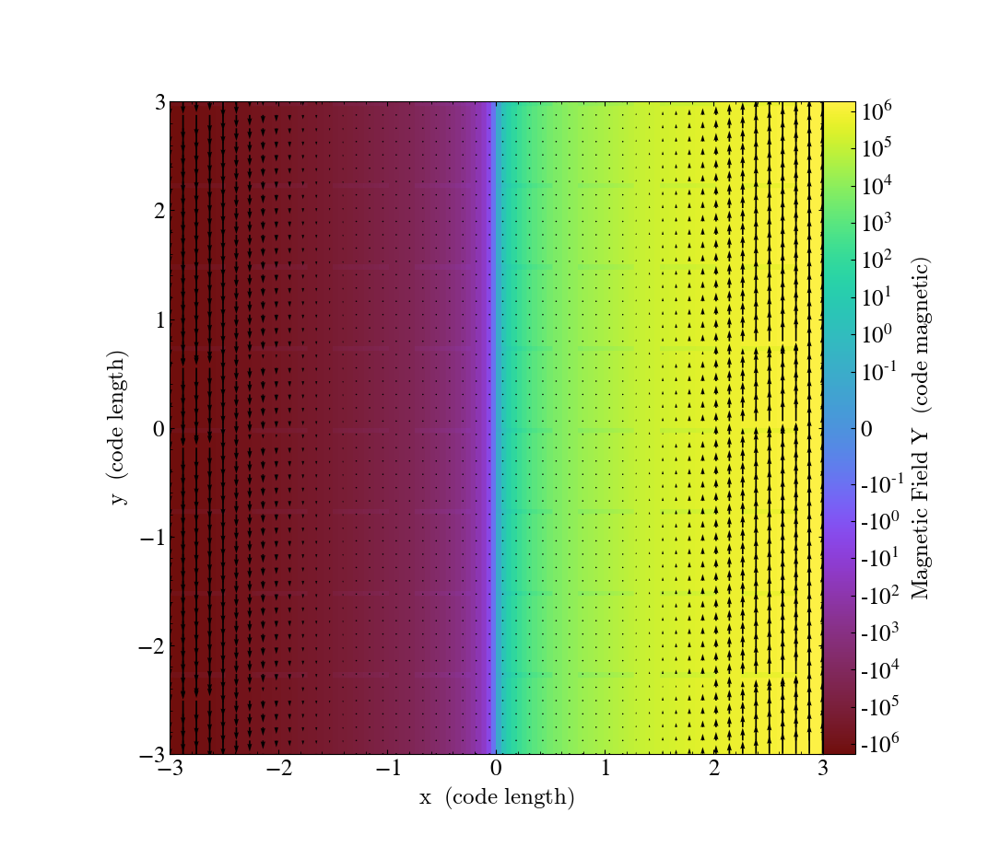

This for loop structure is actually what I/we have returned to, because the other things we have tried have not yielded good results. Regardless, Brian suggested I try filling in all the values deep into the ghost zones of everything, to give me total control over whats happening. Unfortunately, this does not work either. Here is the loop I tried to do for that:

```c++
    for (int k=0; k<=ke+ks+1; k++) {
      for (int j=0; j<=je+js+1; j++) {
        for (int i=0; i<=ie+is+1; i++) {    // j loop for(int j=0; j<=je+js; i++)
          x1 = pcoord->x1v(i);
          if (x1 >= 0.0) {
            pfield->b.x2f(k,j,i) = (b/(beta+1))*std::pow(x1,beta+1);
          } else {
            pfield->b.x2f(k,j,i) = -1.0*(b/(beta+1))*std::pow(std::abs(x1),beta+1);
          }
          pfield->b.x1f(k,j,i) = 0.0;
          pfield->b.x3f(k,j,i) = 0.0;
        }
      }
    }

    if (NON_BAROTROPIC_EOS) {
      for (int k=ks; k<=ke; k++) {
        for (int j=js; j<=je; j++) {
          for (int i=is; i<=ie; i++) {
            phydro->u(IEN,k,j,i) +=
                // second-order accurate assumption about volume-averaged field
                0.5*0.25*(SQR(pfield->b.x1f(k,j,i) + pfield->b.x1f(k,j,i+1))
                          + SQR(pfield->b.x2f(k,j,i)  + pfield->b.x2f(k,j+1,i))
                          + SQR(pfield->b.x3f(k,j,i) + pfield->b.x3f(k+1,j,i)));
                          // Internal Energy is adjusted based on magnetic energy
          }
        }
      }
    }
```

This does not fill in the magnetic fields properly (all constant and 0), but I'm not 100% sure why yet. Every time I run a simulation with this initial condition, the code compiles and runs, but OpenMP dumps the core information out, and spits a ton of errors. I believe this is a product of reaching into the "far corner" of the array domain. I believe (I have not confirmed this yet) all entries of the pfield.b is defined except for `pfield->b.x#f(ke+ks+1, je+js+1, ie+is+1)`. This would explain some of the pointer errors I get after running the simulation:

```
*** Error in `athenaEXE': free(): invalid pointer: 0x00000000009f31f0 ***
*** Error in `athenaEXE': free(): invalid pointer: 0x00000000016d4e90 ***
*** Error in `athenaEXE': free(): invalid pointer: 0x000000000296c030 ***
```

Regardless, this is the output of the initial conditions when generated with the 'full' magpinch case:

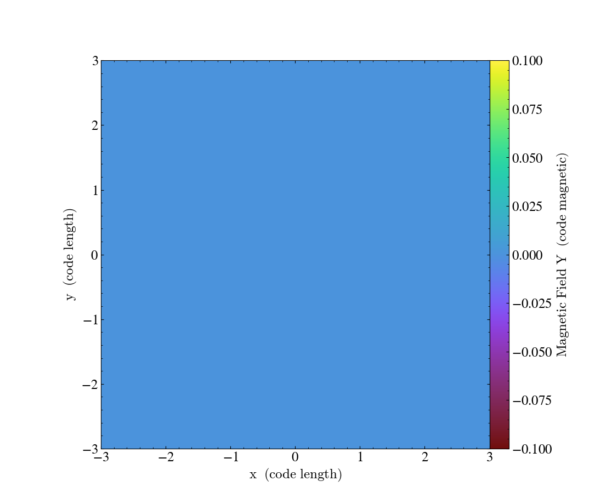

I have resorted back to the three-looped problem generator above, and intend on experimenting with different starting and ending indices. 

I have also been trying to train ChatGPT on Athena to help with debugging, and it has started to give better and better suggestions. It seems to be convinced that the error I'm experiencing stems from the fact that I am not using a vector potential, and therefore simulating unphysical magnetic field conditions. While true, I do not believe this is the cause issue. After a little prodding, it pointed out that I am setting the x-, y-, and z-directions in all three loops. Instead, in the `for (int j=js; j<=je+1; j++)` loop, I should only be setting the `b.x2f` variable, because at `je+1`, the `b.x1f` and `b.x1f` are undefined. Similarly, in the x- and z-loops, I should only be setting the x- and z-magnetic fields (respectively). **THIS FIXES THE MAGNETIC FIELD PROBLEM**, and all the magnetic fields are fully filled in (as of today, May 1). Below are some plots about this issue, because it is the most recent.

Below is the initial magnetic field configuration, with color representing magnetic fields in the y-direction, and vectors representing the directionality of the magnetic field of the fully fixed problem generator:


Here are the initial pressure fields (left) of the initial conditions, and the pressure fields (right) after a single time-step:

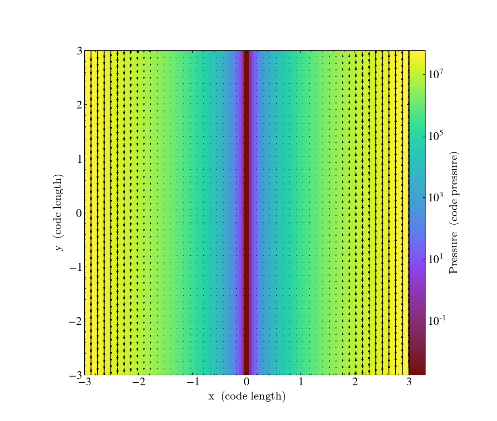     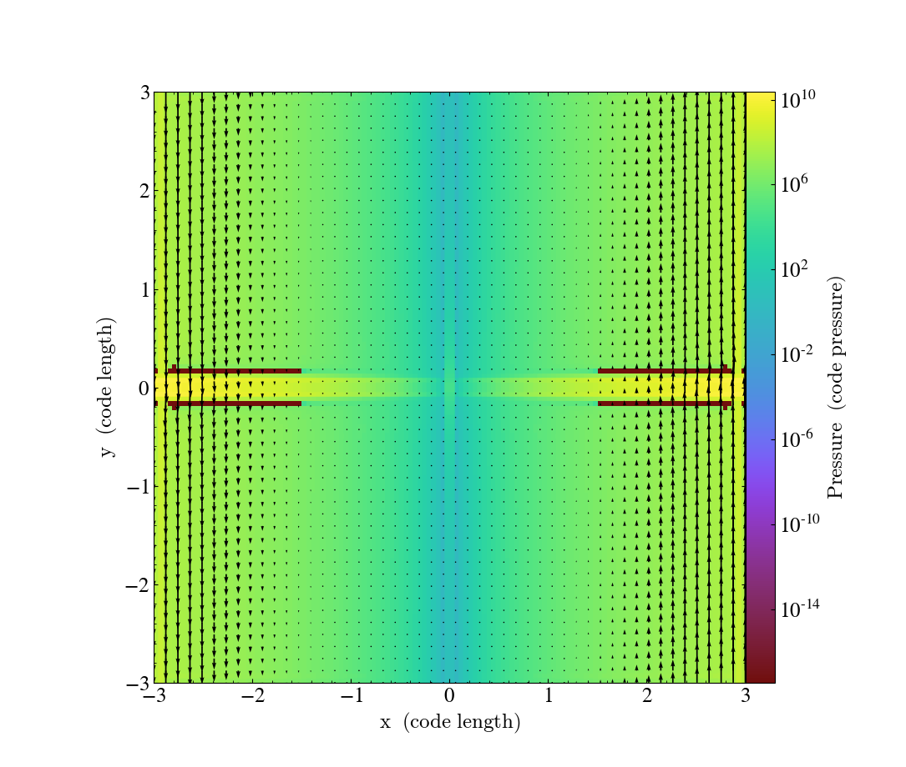

Observe that despite the apparent correctness of the initial conditions, the pressure field is still broken over time, drawing in unknown errors from the boundary along fast inflows. The actual directory with real outputs is `magpinch_fixed_may1` for this simulation. Below are some multiplots showing other details:

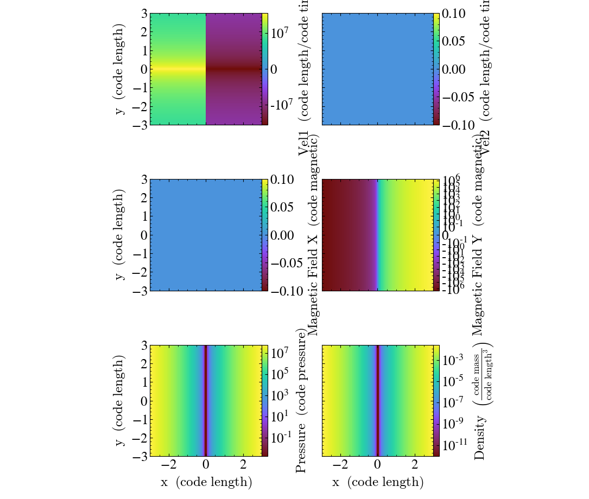     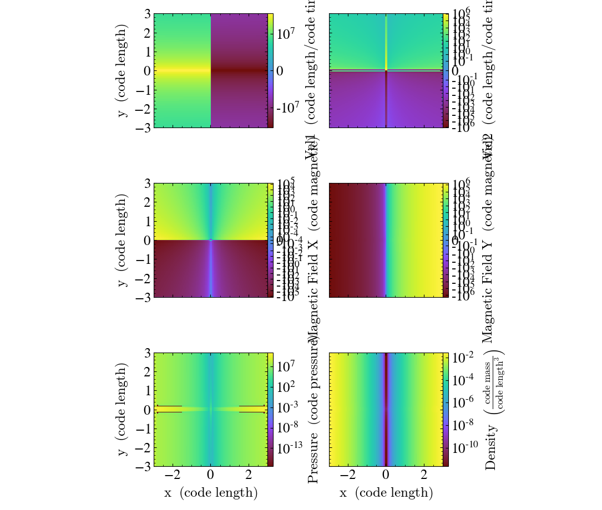

## 05/01/24
I have attempted to fill in everything, but the velocity, pressure, and density fields break when the indices are filled in with the following loop:
```c++
for (int k=0; k<=ke+ks+1; k++) {
    for (int j=0; j<=je+ks+1; j++) {
        for (int i=0; i<=ie+is+1; i++) {
```
Regardless, the magnetic fields are reaching far into the ghost zones and the instabilities below are still not cooperating.

I lied. ChatGPT figured it out. The face-centered magnetic fields only have face-values above je, ke, and ie in the j-, k-, and i-direction respectively. Therefore, we should only set the x, y, and z magnetic field when we iterate over ie+1, je+1, and ke+1, respectively. This fixes the magnetic field issue (pictures above, in the section called Comprehensive List of Everything... May 1). It does *not* fix the pressure issue where NaNs/zeros inflow from the boundary. This is now the same problem we had March 21, which kick-started this whole investigation.

## 04/09/24 - meeting with Brian
Things to try:
- make sure x&z values are set to 0 out into the ghost zones for mag fields
- make sure all y values are set INTO the ghost zones
- Confirm the size of b.x1f, b.x2f, b.x3f have sizes (n+1)xnx1, etc. 
- As a sanity check: change the code in `magpinch.cpp` to set the magnetic field in EVERY cell for EVERY dimension - make the loops go from i,j,k = 0 to i,j,k = MAX (MAX might be is+ie+1)?  **DO THIS IN A NEW .CPP FILE - PROTECT YOURSELF FROM YOURSELF**
- Ask Ben or Google how to make experimental branches of git repos

## 04/07/24 - Discussion with Ben
I talked with Ben who asked me some simple questions about pressure and temperature in the simulations, and I realized I need to figure out how the units in Athena work. He asked about Pressure, so I went to double check the pressure definition in `magpinch.cpp` and it is set to the magnetic pressure. That is why the initial pressure plots look so bad for the B=0 case. That said, I have a few things I need to try to fix the bad values coming in from the boundaries.
 - The mach number at those bad values are also bad, which Ben thinks is an issue with the initial speed. The simulation that was plotted below on 03/21 had initial velocities of 2e7, which is *fast*, but not too fast. Therefore we should set the velocity to a mach number somewhere between 2 and 5, to force a shock at the center, but not push the simulation too much.
 - The pressure wholly depends on magnetic field, so I need to add a base case where the mach number is 2 or 3, and add it to the pressure in the problem generator to ensure that when the magnetic field is 0, the pressure is still nonzero.

As a reminder to myself ($\gamma=2.0$), sound speed is $c_{s}=\sqrt{\gamma\frac{p}{\rho}}$, mach number is $v/c_s$, and the initial velocity profile ($x>0$) is given by $u=-\frac{\rho v_{in}}{y+1/3}$ with $v_{in}$ from the athinput file. Additionally, magnetic fields are filled in with $B=\pm \frac{B_0}{\beta+1} (x)^{\beta+1}$ which peaks at $x=3$, and should yield 0 at the center. By default $\beta=2.5$ (this is defined in athinput file as well).

As a litmus test, I set the magnetic field to 5e3, $v_{in}$ to 2e4, and when I check the magnetic field strenght plot in YT, it is not fully uniform in the y direction which it needs to be.

I reordered the way magnetic fields are set again within the problem generator in order of execution:
```c++
    for (int k=ks; k<=ke; k++) {
      for (int j=js; j<=je+1; j++) {
        for (int i=is; i<=ie; i++) {

    for (int k=ks; k<=ke+1; k++) {
      for (int j=js; j<=je; j++) {
        for (int i=is; i<=ie; i++) {

    for (int k=ks; k<=ke; k++) {
      for (int j=js; j<=je; j++) {
        for (int i=is; i<=ie+1; i++) {
```

 Below are the outputs of this problem generator, with $B_0$ set to 5e3, $v_{in}$ to 2e4. This fixed the sloppy initial conditions. More work needs to be done on completing the problem generator to fully describe all fields inside each meshblock. On **the left is t=0, on the right is t=1**. The files which generate this are in the aptly named `new_pgen_magpinch` file in the scratch directory.

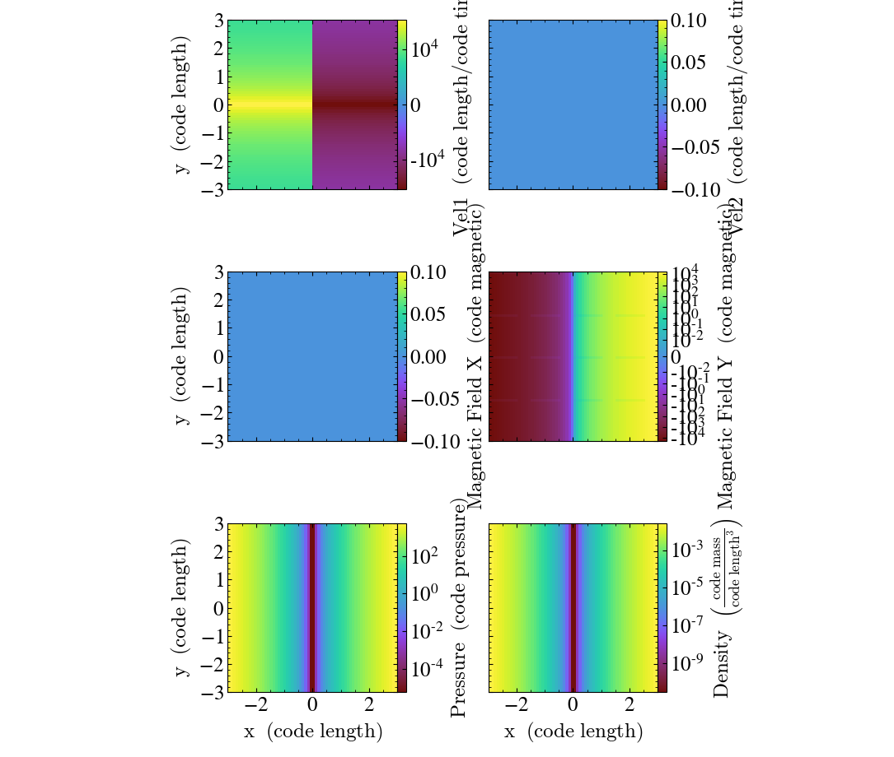      


## 04/02/24 - Debugging time
When I run the debugger, I put breakpoints all throughout the OutflowInnerX1() method in the `src/bvals/cc/outflow_cc.cpp` file. From one step to the next, it looks like it is pulling 0s from the boundary and placing them in the simulation zone. It is working exactly as it should, so I think it is really a root cause in my problem generator...

## 04/01/24 - Investigating Boundary Value Problems
I FOUND IT. There was a folder called `src/bvals` which has all the code that runs the boundary value problems... How elegant. The specific outflow file is in `src/bvals/cc/outflow_cc.cpp` which is only 137 lines long...

TODO I just thought of this as I was skimming through the Athena++ methods paper... There is a chance that this issue could come from the fact that I have set up a situation where in the center the divergence of the magnetic field is infinite at the center slice. I don't anticipate this being an issue because Athena++ solves iteratively, but maybe (?)...


## 03/27/24 & 04/01/24 - Notes on Athena++ flow
 - [Athena++ Method Paper](https://ui.adsabs.harvard.edu/abs/2020ApJS..249....4S/abstract)
 - Added a few alias commansd in ~/.bashrc to make working in this document easier.
 - Started a flow chart for athena, and I have the following questions:
    + There are a whole lot of MPI_Finalize() calls floating around, but not a lot of initialization calls going around. I know [MPI_Finalize does not actually destroy any information](https://stackoverflow.com/a/2290951/893863), but I don't understand why MPI is working the way it is in this code.

Inside Athena++, main.cpp is the brain of the operation. There are 10 main steps:
 1. (Line 71) Initializing environment
 2. (Line 117) Grabbing command line arguments
 3. (Line 216) Parsing input file and command line arguments.
    - When MPI is initialized, the input file is read by every process
    - This part of the code relies wholly on src/parameter_input.cpp (and .hpp)
        + It grabs all the important data about meshblocks and the specific problem generator from the athinput.* file.
 4. (Line 264) Constructing and initializing mesh
    - This part of the code works out of src/mesh/mesh.cpp (and .hpp)
        +  at first glance, this is only responsible for AMR and initialization, NOT dealing with boundary conditions in the middle of runs.
 5. (Line 325) Constructing a "TaskList" for the integrator
    - This part goes WAY over my head, because its full of `if (integrator == "thing") {` commands, which I understand at face value, but the details of this step are lost on me.
    - I believe this step is initializing the integrator so it can be called faster (?) in the future.
 6. (Line 364) Initial conditions from problem generator.
    - This is where the "Initialize()" function is called, but I cannot find *where* this is defined. (old to do) find where Initialize function is defined.
 7. (Line 390) Create output object, and output ICs
    - This part is not the problem part, and there is nothing immediately confusing about it, so I am moving on.
    - Run from src/outputs/outputs.cpp (and .hpp)
    - `pouts` object is what acutally makes the outputs.
    - `pouts->MakeOutputs(mesh,input)` method is what actually makes the files
 8. (Line 420) Main integration loop
    - Conditions for integration loop: `(pmesh->time < pmesh->tlim) && (pmesh->nlim < 0 || pmesh->ncycle < pmesh->nlim)`
    - On rank 0, `pmesh->OutputCycleDiagnostics()`
    - By default, we don't have supertimestepping enabled, so we skip lines 437-357
    - By default, we don't have driven turbulence enabled, so we skip line 459
    - Inside the main loop is the following for loop:
    ```c++
        for (int stage=1; stage<=ptlist->nstages; ++stage) {
            ptlist->DoTaskListOneStage(pmesh, stage);
            //Then a bunch of self_gravity checks
        }
    ```
    - The `DoTaskListOneStage(pmesh, stage)` calls `DoAllAvailableTasks(mesh, stage)`, which at some point digs into meshblock.cpp to run the time measurement schemes.
    - Next it calls `pmesh->UserWorkInLoop()` which I **finally found** in the src/mesh/mesh.cpp (line 1679). Looks like the code that is responsible for setting the boundary buffers is the call of `pmb->pscalars->sbvar.SendBoundaryBuffers()` or the mesh function `SetBlockSizeAndBoundaries`
    - The method paper claims that boundary conditions are applied on the coarse buffer of each meshblock on 'step 5' of the meshblock communication cycle.
 9. (Line 524) Output final cycle diagnostics
    - Makes the output files for the last timestep in case it doesn't align with the stopping time
 10. (Line 555) Print diagnostic messages related to end of simulation
    - Namely what the termination conditions were, how many cycles Athena++ went through, and what the time limit was.
    - Deletes a lot of variables, and finalizes MPI
    

## 03/25/24
To do list (completed)
 - Make a custom flow chart to track what Athena is actually doing
 - Set up debugger to track boundary conditions, and values. Make sure it is actually just copying rows and columns of data across to the boundary and that the zero-gradient is doing what I need it to be doing
 - Make plots of LOTS of fields and values to see if we can spot where the bad values are arriving.

## 03/21/24
The issue is not, in fact, fixed. Turns out there are 3 dimensions in real life, and all three need fields defined. I added those definitions, but the temperature is still doing really weird things. This is an image from the standard inputs, with 128x128 cells, 16x16 blocks, B0=5e5, v0=2e7 (fixed_magpinch) (left), and the same setup with B=0 (right). These plots are both at the end of the simulation time.
- 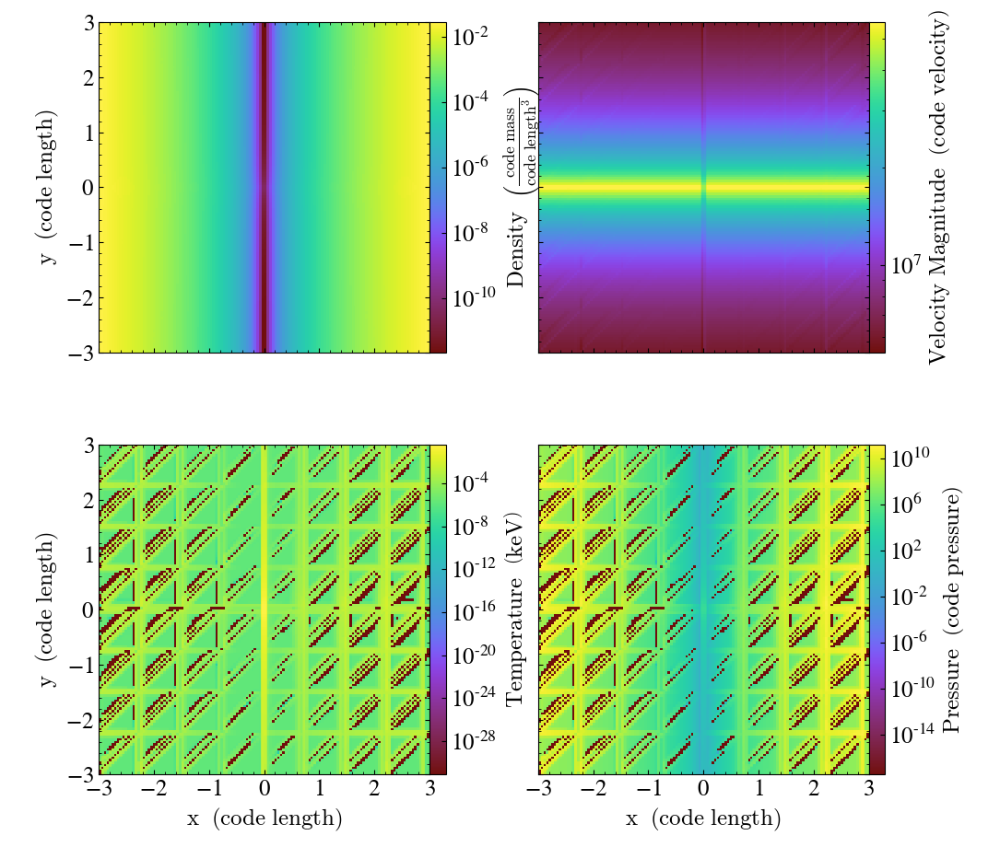      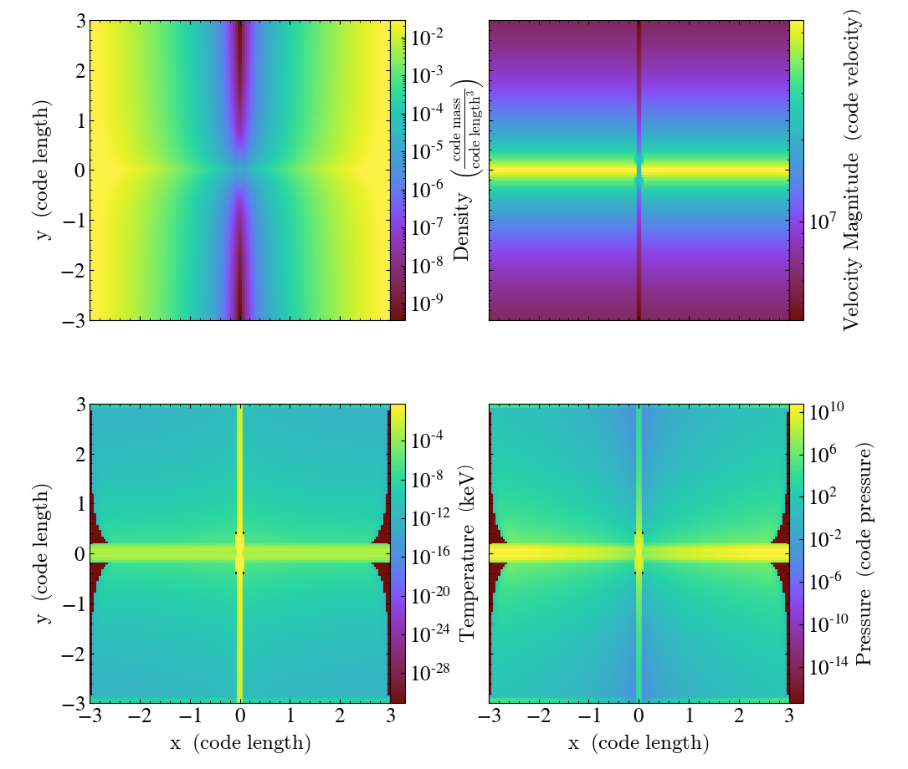

The changes I made to the problem generator (I added two more nested for loops to account for the y- and z- direction B-field in each meshblock...):

```c++
for (int k=ks; k<=ke; k++) {
    for (int j=js; j<=je+1; j++) {
        for (int i=is; i<=ie; i++) {
            // Same as x-direction
        }
    }
}
for (int k=ks; k<=ke+1; k++) {
    for (int j=js; j<=je; j++) {
        for (int i=is; i<=ie; i++) {
            // Same as x-direction
        }
    }
}
```

For some reason, it looks like the bad values of pressure and temperature are coming in from the boundaries that have velocity pointing away from them. I don't know what to make of that. There is also something goofy going on with the velocity magnitude at the +/-y boundaries, which doesn't make sense because the y-velocity at the boundaries should be 0.


## 03/20/24 - Fixed checkerboard issue
Brian noticed a few days ago that it very well might be a face-centered field initialization problem in my problem generator. The face centered fields for some reason need to be set from i=1 to i=ie+1 and j=1 to j=je+1. I originally missed this when I made this problem generator.
+ This fixed the issue:
    - 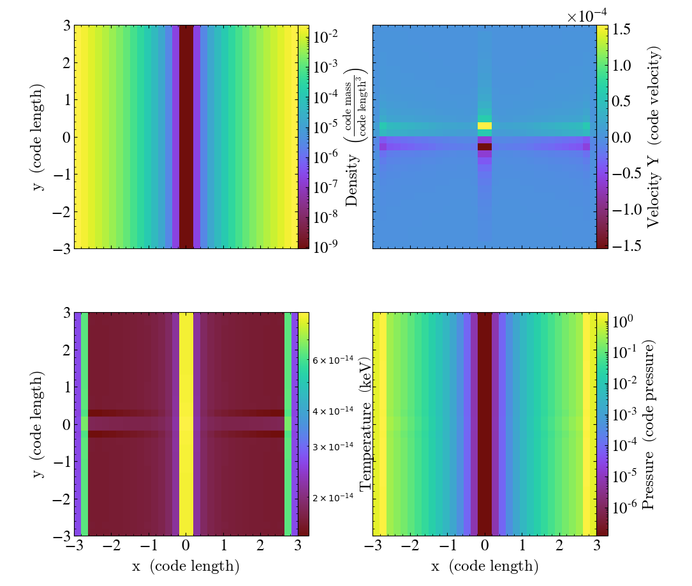

## 03/18/24

I am trying to hunt down what is causing checkerboard instabilities in simple Athena++ geometries. Specifically in the "magpinch.cpp" problem generator. Currently, it seems to be a problem with the y-velocity, and likely a halo exchange (each processor grabbing the required ghost zones to do the solve) in the positive y edge of each block. 

Old to do list:
+ (done) Make a Research Notebook
+ Change the meshblocks of the Athena++ input file to be larger (than 4x4), because the ghost zones might be reaching too far into the neighboring blocks which might be causing the instabilities
    - I ran a 32x32 with 16x16 blocks and the issue persists (big_mesh_magpinch/):
    -         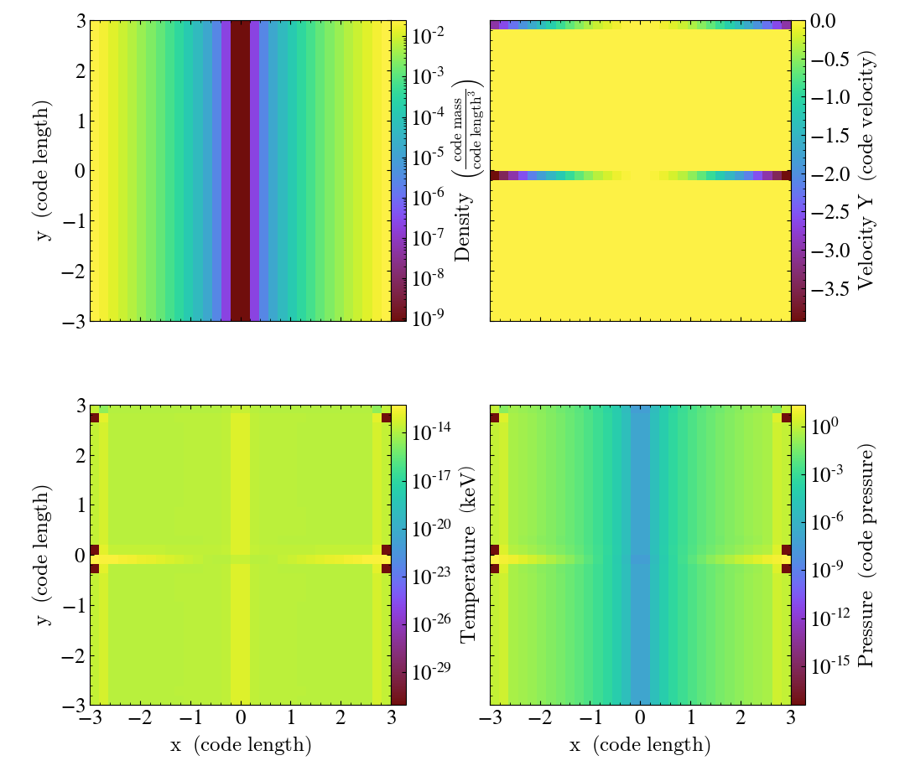
+ Set the magnetic fields to 0, and see what if the instabilities and errors persist. This will probably tell us if it is an MHD problem or a hydro problem, or some combination of the two.
    - Using the 16x16 blocks, and the same problem generators as above, the errors change, and now they are no longer at the halo but in the center of the region, at the intersection of all of them? Makes me think the issue isn't with the halos... (no_B_magpinch)
    - 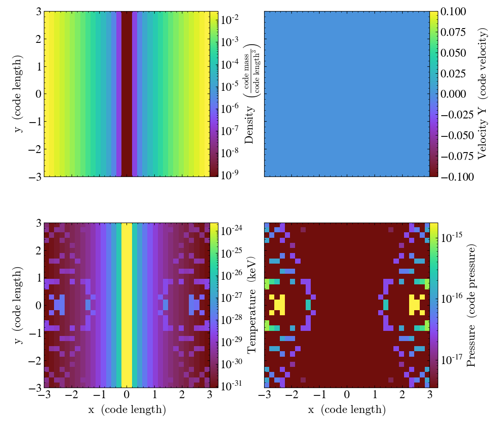        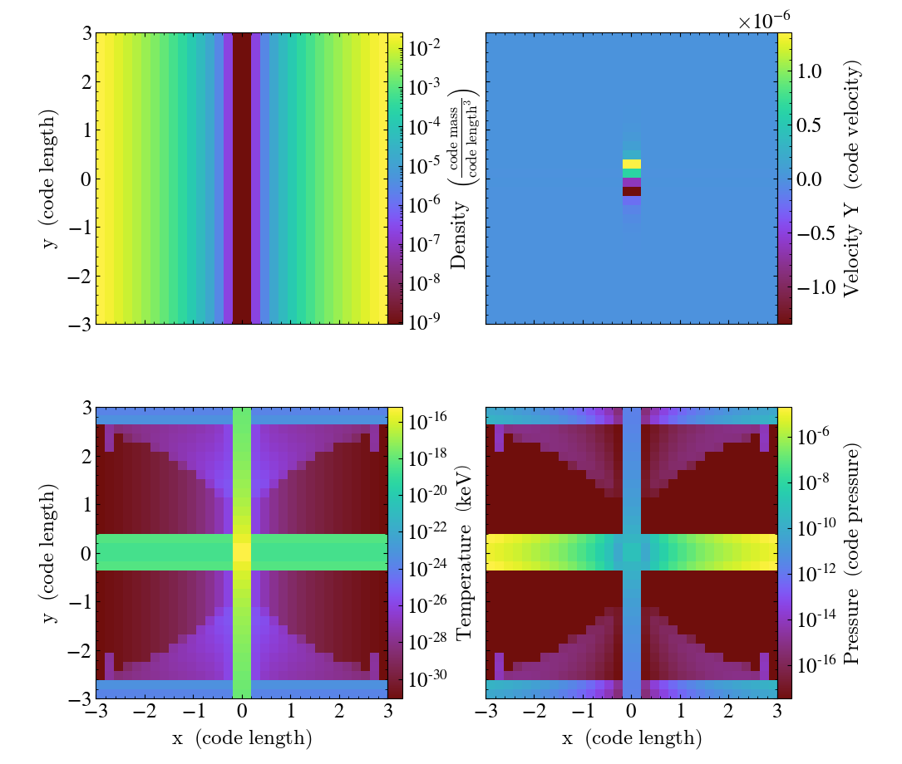
    - On a whim, I tried it again with v=0, and it didn't change the above outputs (no_B_no_V_magpinch).
    - Trying again with $B=0$, $v\neq 0$, back to the small meshes (no_B_small_mesh_magpinch) gave no difference to the above output.
    
+ Run a magnoh.cpp problem and a magpinch problem side by side to see if the errors are present for the problem generator I don't write.

If these things don't work, I need to sit down and make a flow chart that describes how the code runs so I can use vscode debugger to track the values of the halo exchange.
